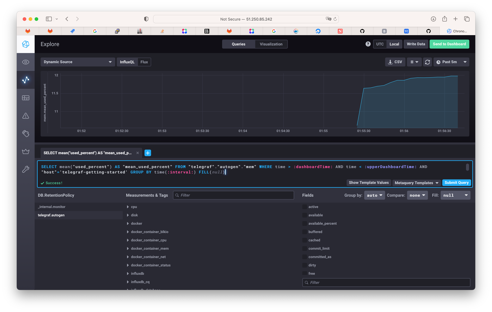
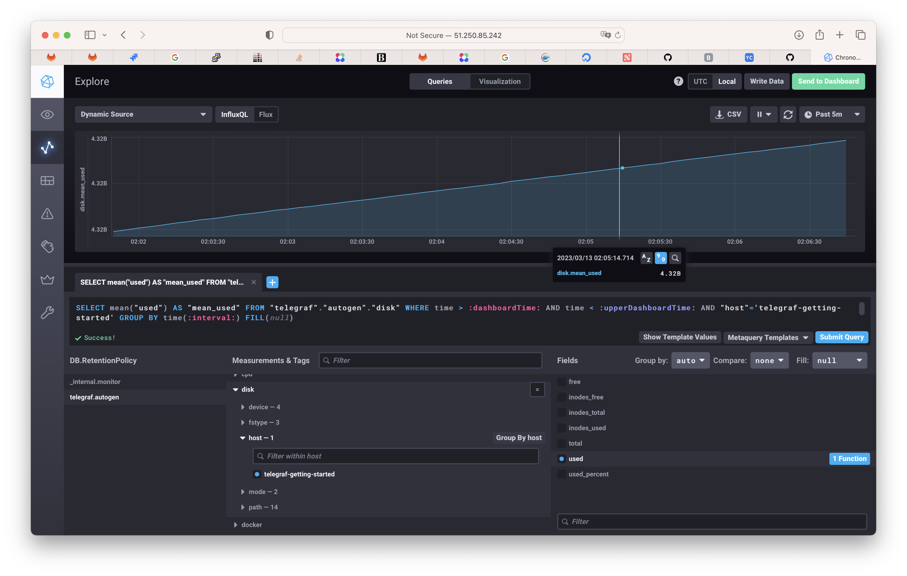
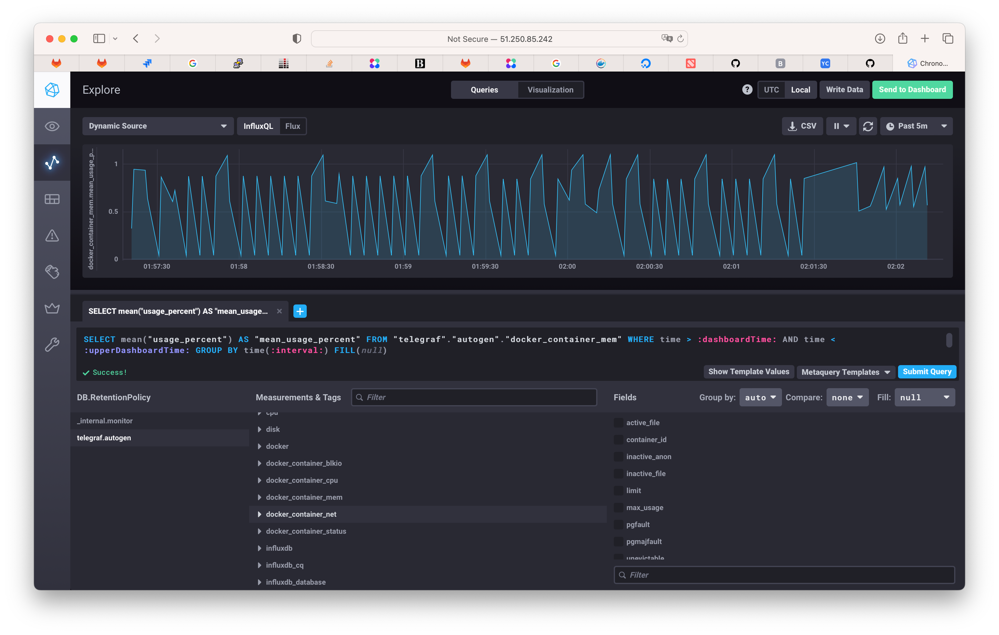

# Домашнее задание к занятию "13.Системы мониторинга"

## Обязательные задания

1. Вас пригласили настроить мониторинг на проект. На онбординге вам рассказали, что проект представляет из себя 
платформу для вычислений с выдачей текстовых отчетов, которые сохраняются на диск. Взаимодействие с платформой 
осуществляется по протоколу http. Также вам отметили, что вычисления загружают ЦПУ. Какой минимальный набор метрик вы
выведите в мониторинг и почему?

> Ответ:
> Так как отчёты сохраняются на диск, то нам нужно следить за заполненностью диска, надо мониторить метрику node_filesystem_avail_bytes.
> Также нам нужна метрика мониторинга IOPS, чтобы следить за количеством IOPS и понять, когда дисковая система будет перегружена.
> Также нам нужно мониторить количество свободных inodes, так как если они закончатся, то мы не сможем создавать новые файлы.
> Взаимодействие происходит по http, поэтому нам нужно знать статистику http ответов сервера, http_requests_total и отдельно по 400 и 500 ответам.
> Мы можем включить метрику по загрузке RAM node_memory_usage, чтобы следить за загрузкой памяти.
> Вычисления загружают CPU, поэтому включим мониторинг node_cpu_seconds_total.

#
2. Менеджер продукта посмотрев на ваши метрики сказал, что ему непонятно что такое RAM/inodes/CPUla. Также он сказал, 
что хочет понимать, насколько мы выполняем свои обязанности перед клиентами и какое качество обслуживания. Что вы 
можете ему предложить?

> Ответ:
> Я могу предложить менеджеру мониторинг по методологии USE
> 
> Utilization — время или процент использования ресурса, занятого «полезной работой»:
> Средняя загрузка ЦП: не превышает 80%
> Используемая оперативная память: не более 60% от установленного объема
> Свободное место на диске: не менее 20%
> Средняя нагрузка на канал передачи данных: не более 75%
> Cвободные файловые дескрипторы: не менее 20%
> 
> Saturation — насыщенность, то есть количество отложенной или поставленной в очередь «работы»;
> Доступность по http: не доступно более 4 запросов (частота запросов берётся из статистики)
> Время ожидания ответа: не ниже порогового в течение 3 минут
> Время отклика сервера: не более 500 мс
> Бездействие системы: не менее 10% в течение 10 минут
> Количество операций чтения/записи на дисковую подсистему: не превышает порогового значения за 5 минут
> 
> Errors — количество ошибок в работе компонента.
> Количество ответов 4хх и 5хх: не выше порогового в течение 1 минуты и не более 5% за cутки (берём KPI 95%)
> Наличие ошибок в логах продукта: по каждой ошибке создаётся инцидент и назначается дежурной смене


#
3. Вашей DevOps команде в этом году не выделили финансирование на построение системы сбора логов. Разработчики в свою 
очередь хотят видеть все ошибки, которые выдают их приложения. Какое решение вы можете предпринять в этой ситуации, 
чтобы разработчики получали ошибки приложения?

> Ответ:
> Мы можем настроить в шедуллере ОС сервера скрипт копирования логов приложения по расписанию на сетевую папку и дать разработчикам
> доступ к ней. После этого научить разработчиков грепать логи по ключевым словам: ERROR, CRITICAL, WARNING.
> Также мы можем настроить триггеры в системе мониторинга на появление в логах ключевых слов и настроить оповещение на
> разработчиков.

#
4. Вы, как опытный SRE, сделали мониторинг, куда вывели отображения выполнения SLA=99% по http кодам ответов. 
Вычисляете этот параметр по следующей формуле: summ_2xx_requests/summ_all_requests. Данный параметр не поднимается выше 
70%, но при этом в вашей системе нет кодов ответа 5xx и 4xx. Где у вас ошибка?

> Ответ:
> Нас интересуют 3хх и 2хх ответы, правильнее было бы сделать формулу 
> (summ_2xx_requests + summ_3xx_requests)/(summ_all_requests)
> Таким образом мы получим процент всех ответов 3xx и 4xx

#
5. Опишите основные плюсы и минусы pull и push систем мониторинга.

> Ответ:
> push системы имеют следующие преимущества:
> - упрощение репликации данных в разные системы мониторинга или их резервные копии 
> - более гибкая настройка отправки пакетов данных с метриками
> - UDP — это менее затратный способ передачи данных, из-за чего может возрасти производительность сбора метрик

> pull системы имеют следующие преимущества:
> - легче контролировать подлинность данных
> - можно настроить единый proxy server до всех агентов с TLS 
> - упрощённая отладка получения данных с агентов

Лучше всего комбинировать push и pull мониторинг

#
6. Какие из ниже перечисленных систем относятся к push модели, а какие к pull? А может есть гибридные?

    - Prometheus 
    - TICK
    - Zabbix
    - VictoriaMetrics
    - Nagios

> Ответ:
> - Zabbix: push и pull модель
> - Prometheus: pull модель
> - TICK - push модель
> - VictoriaMetrics: push и pull модель
> - Nagios: pull модель

#
7. Склонируйте себе [репозиторий](https://github.com/influxdata/sandbox/tree/master) и запустите TICK-стэк, 
используя технологии docker и docker-compose.

В виде решения на это упражнение приведите выводы команд с вашего компьютера (виртуальной машины):

    - curl http://localhost:8086/ping
    - curl http://localhost:8888
    - curl http://localhost:9092/kapacitor/v1/ping

А также скриншот веб-интерфейса ПО chronograf (`http://localhost:8888`). 

P.S.: если при запуске некоторые контейнеры будут падать с ошибкой - проставьте им режим `Z`, например
`./data:/var/lib:Z`

> Ответ:
> curl http://localhost:8086/ping

```commandline
roman@tick:~/sandbox$ curl http://localhost:8086/ping
roman@tick:~/sandbox$ 
```

> curl http://localhost:8888
```commandline
roman@tick:~/sandbox$ curl http://localhost:8888
<!DOCTYPE html><html><head><link rel="stylesheet" href="/index.c708214f.css"><meta http-equiv="Content-type" content="text/html; 
charset=utf-8"><title>Chronograf</title><link rel="icon shortcut" href="/favicon.70d63073.ico"></head><body> <div id="react-root" 
data-basepath=""></div> <script type="module" src="/index.e81b88ee.js"></script><script src="/index.a6955a67.js" nomodule="" 
defer></script> </body></html>
roman@tick:~/sandbox$ 
```

> curl http://localhost:9092/kapacitor/v1/ping

```commandline
roman@tick:~/sandbox$ curl http://localhost:9092/kapacitor/v1/ping
roman@tick:~/sandbox$ 
```

> скриншот веб-интерфейса ПО chronograf


#
8. Перейдите в веб-интерфейс Chronograf (`http://localhost:8888`) и откройте вкладку `Data explorer`.

    - Нажмите на кнопку `Add a query`
    - Изучите вывод интерфейса и выберите БД `telegraf.autogen`
    - В `measurments` выберите mem->host->telegraf_container_id , а в `fields` выберите used_percent. 
    Внизу появится график утилизации оперативной памяти в контейнере telegraf.
    - Вверху вы можете увидеть запрос, аналогичный SQL-синтаксису. 
    Поэкспериментируйте с запросом, попробуйте изменить группировку и интервал наблюдений.

Для выполнения задания приведите скриншот с отображением метрик утилизации места на диске 
(disk->host->telegraf_container_id) из веб-интерфейса.

> Ответ:


#
9. Изучите список [telegraf inputs](https://github.com/influxdata/telegraf/tree/master/plugins/inputs). 
Добавьте в конфигурацию telegraf следующий плагин - [docker](https://github.com/influxdata/telegraf/tree/master/plugins/inputs/docker):
```
[[inputs.docker]]
  endpoint = "unix:///var/run/docker.sock"
```

Дополнительно вам может потребоваться донастройка контейнера telegraf в `docker-compose.yml` дополнительного volume и 
режима privileged:
```
  telegraf:
    image: telegraf:1.4.0
    privileged: true
    volumes:
      - ./etc/telegraf.conf:/etc/telegraf/telegraf.conf:Z
      - /var/run/docker.sock:/var/run/docker.sock:Z
    links:
      - influxdb
    ports:
      - "8092:8092/udp"
      - "8094:8094"
      - "8125:8125/udp"
```

После настройке перезапустите telegraf, обновите веб интерфейс и приведите скриншотом список `measurments` в 
веб-интерфейсе базы telegraf.autogen . Там должны появиться метрики, связанные с docker.

Факультативно можете изучить какие метрики собирает telegraf после выполнения данного задания.

> Ответ:


## Дополнительное задание (со звездочкой*) - необязательно к выполнению

1. Вы устроились на работу в стартап. На данный момент у вас нет возможности развернуть полноценную систему 
мониторинга, и вы решили самостоятельно написать простой python3-скрипт для сбора основных метрик сервера. Вы, как 
опытный системный-администратор, знаете, что системная информация сервера лежит в директории `/proc`. 
Также, вы знаете, что в системе Linux есть  планировщик задач cron, который может запускать задачи по расписанию.

Суммировав все, вы спроектировали приложение, которое:
- является python3 скриптом
- собирает метрики из папки `/proc`
- складывает метрики в файл 'YY-MM-DD-awesome-monitoring.log' в директорию /var/log 
(YY - год, MM - месяц, DD - день)
- каждый сбор метрик складывается в виде json-строки, в виде:
  + timestamp (временная метка, int, unixtimestamp)
  + metric_1 (метрика 1)
  + metric_2 (метрика 2)
  
     ...
     
  + metric_N (метрика N)
  
- сбор метрик происходит каждую 1 минуту по cron-расписанию

Для успешного выполнения задания нужно привести:

а) работающий код python3-скрипта,

б) конфигурацию cron-расписания,

в) пример верно сформированного 'YY-MM-DD-awesome-monitoring.log', имеющий не менее 5 записей,

P.S.: количество собираемых метрик должно быть не менее 4-х.
P.P.S.: по желанию можно себя не ограничивать только сбором метрик из `/proc`.

2. В веб-интерфейсе откройте вкладку `Dashboards`. Попробуйте создать свой dashboard с отображением:

    - утилизации ЦПУ
    - количества использованного RAM
    - утилизации пространства на дисках
    - количество поднятых контейнеров
    - аптайм
    - ...
    - фантазируйте)
    
    ---

### Как оформить ДЗ?

Выполненное домашнее задание пришлите ссылкой на .md-файл в вашем репозитории.

---
